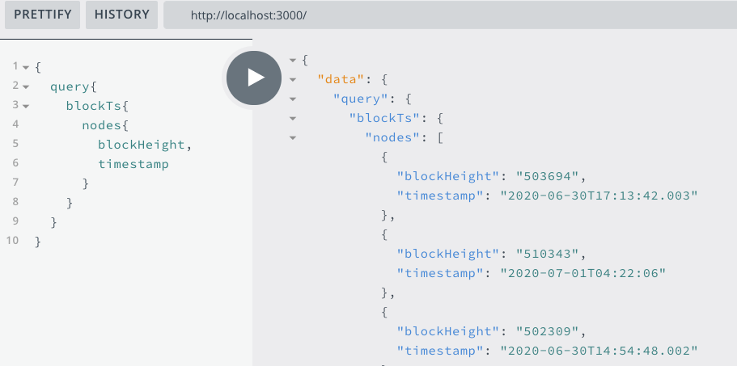

# SubQuery Example - Timestamp of Blocks

This subquery example indexes the timestamp of each finalized block.

It is an example of CallHandler, and by processing the `timestamp.set` extrinsic, and extracting the first args of it, we can retrieve the timestamp.

# Getting Started

### 1. Clone the entire subql-example repository

```shell
git clone https://github.com/subquery/subql-examples.git

```

### 2. Install dependencies

```shell
cd block-timestamp
yarn
```

### 3. Generate types

```shell
yarn codegen
```

### 4. Build the project

```shell
yarn build
```

### 5. Run locally

```shell
yarn start:docker
```

### 5. Example query to run

```shell
{
  query{
    blockTs{
      nodes{
        blockHeight,
        timestamp
      }
    }
  }
}
```

### 5. Expected output



# Understanding this project

As mentioned above, this project has a function called handleTimestampSet which is defined in the mappings file called BlockTs.ts. It uses a CallHandler which is defined in the manifest file (project.yaml) as "kind: substrate/CallHandler"

The schema.graphql file defines the variables blockHeight and timestamp which are both mandatory and of type BigInt and Date respectively.

If we examine the code in BlockTs.ts in more detail, you can see that the function handleTimestampSet takes one argument of type SubstrateExtrinsic. It then creates a new instance of BlockTs passing in the extrinsic.blockblock.header.hash argument as a string and assigning this to the variable record.

Next, the blocknumber is converted to a BigInt and assigned to record.blockHeight which is a BlockTs entity meaning that the fields within are accessed with a dot.

For the timestamp, this is extracted from the first argument of the extrinsic using the moments JS library. It then gets converted a Date object, then serialized as a number before being assigned to the timestamp field.
